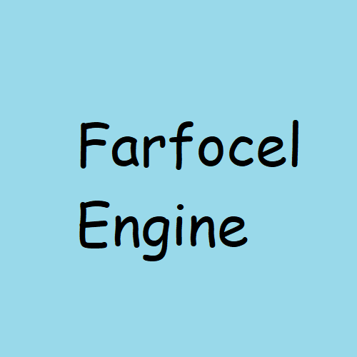

# Purely written in my free time
The progress is slow as I often don't have it.

#Currently working on:
Converting the project from Premake to CMake.

# Recent changes:
1) Removed a memory leak in State Manager - now the states are actually deleted properly.
2) Added a StartupConfigurationFile.hpp util, which now is only used by the engine. It's still messy and I'm still not sure if it is necessary.
3) Redesigned Input and Event managers. Before, it was possible to delete entries while iterating through the map, which would result in a crash. Now, I added an additional state in FunctionBinder (which got renamed from FunctionBinding). It's used to determine if the entry in the map should be removed before iterating.

# How to compile
### On Windows
You can use the 'build.bat' script to generate a Visual Studio solution and compile it or you can setup MinGW on your system and generate Makefiles to compile the project that way.
### On Linux
I didn't test it on Linux yet, so this might not work. You can generate Makefiles using Premake and then compile the project using Make.
### On MacOS
I didn't test it on MacOS yet, but the idea should be the same as on Linux.
