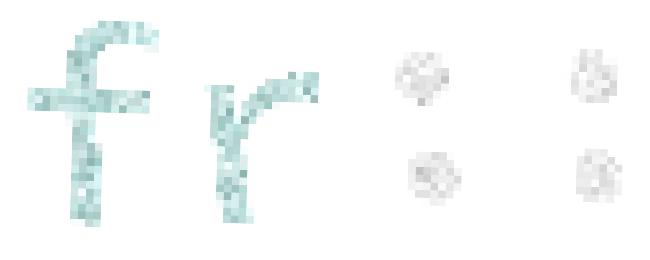
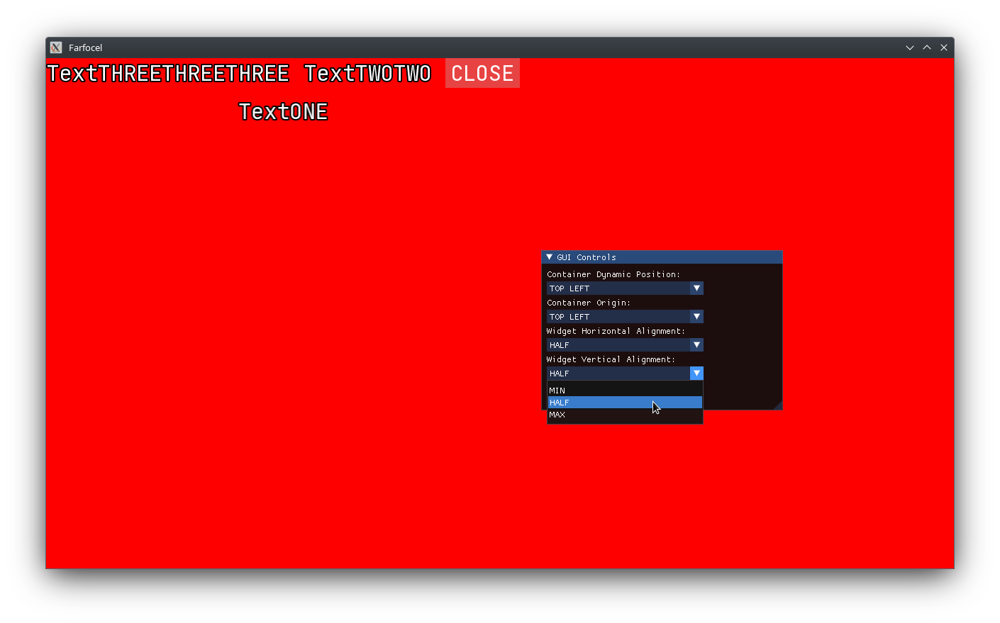

## https://farfocel.tech/
Farfocel is my free-time project. I develop it "when I want", and that translates to "slow progress".

## Latest changes
* fr::Console - native Terminal/Console utility, for printing debug messages. In the future I want to add LUA support. Enable it by pressing ~
* Farfocel GUI Preview:
    - frg::Container
    - frgu::ContainerColumn
    - frg::Style
    - frg::Widget
    - frg::Text
    - frg::Button

Check Vifon for GUI demo:

## What's Vifon?
Vifon is for testing Farfocel. It's a sandbox project.

You can use it as a blueprint for creating your own one.

## Building Farfocel
Farfocel uses [Dear ImGui](https://github.com/ocornut/imgui), [Dear ImGui-SFML](https://github.com/SFML/imgui-sfml), [SFML](https://github.com/SFML/SFML) and CMake for project generation.

Toggle 'FARFOCEL_BUILD_SHARED' to build Farfocel as a static or dynamic library.

### Setting up on Windows
On Windows, CMake fetches all needed libraries, so there's no need to have them installed.

### Setting up on MacOS & Linux
On MacOS & Linux, CMake expects SFML to be already installed, and fetches the other libraries automatically.